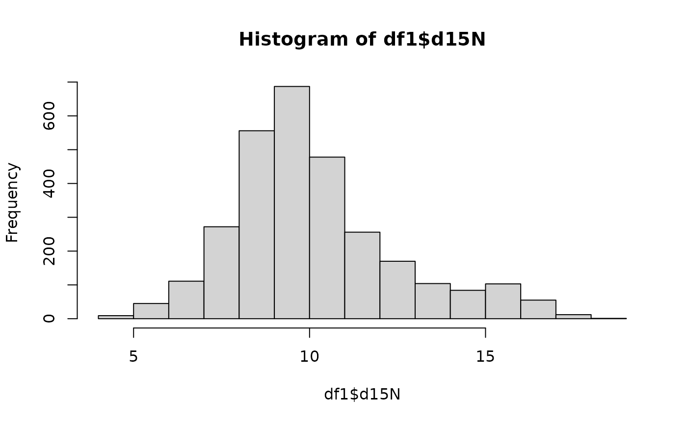

# How to Use IsoMemo for Researchers

- `getRemoteDataAPI()` retrieves the API to query the data
- `getMappingAPI()` calls the mapping for the fields needed from the
  user API calls
- [`getDatabaseList()`](https://pandora-isomemo.github.io/isomemo-data/reference/getDatabaseList.md)
  returns a list of database names linked to the API call
- [`callAPI()`](https://pandora-isomemo.github.io/isomemo-data/reference/callAPI.md)
  initiates the request to call

``` r

library(IsoMemo)
getDatabaseList() # returns a character format of list of database names linked to the API call
#> [1] "14CSea"   "CIMA"     "IntChron" "LiVES"
```

``` r

df = getData(db = "IntChron", category = "Location", field = "latitude", mapping = "IsoMemo")
# see latitude and longitude of each site
summary(df)
#>     latitude     
#>  Min.   :-35.51  
#>  1st Qu.: 25.74  
#>  Median : 36.64  
#>  Mean   : 31.73  
#>  3rd Qu.: 50.91  
#>  Max.   : 75.28  
#>  NAs    :44279
```

The function below retrieves ALL data and fields from all existing
databases.

``` r

# ALL_DATA = getData()
# print(nrow(ALL_DATA)) # check how many rows
# levels(ALL_DATA$source) # check all the database sources are there
```

### Let’s explore another database: LiVES

``` r

getDatabaseList() # tells what database are currently published
#> [1] "14CSea"   "CIMA"     "IntChron" "LiVES"

df1 = getData('LiVES')
summary(df1)
#>    source             id          description        d13C       
#>  LiVES:3664   Length   :3664   Length   :3664   Min.   :-25.00  
#>               N.unique :3664   N.unique :3591   1st Qu.:-20.65  
#>               N.blank  :   0   N.blank  :   0   Median :-19.89  
#>               Min.nchar:   2   Min.nchar:  12   Mean   :-19.66  
#>               Max.nchar:   4   Max.nchar:  72   3rd Qu.:-19.10  
#>                                                 Max.   :-10.27  
#>                                                 NAs    :60      
#>       d15N          latitude       longitude              site     
#>  Min.   : 4.38   Min.   :32.36   Min.   :-10.439   Length   :3664  
#>  1st Qu.: 8.60   1st Qu.:40.42   1st Qu.:  7.506   N.unique : 676  
#>  Median : 9.70   Median :48.57   Median : 13.847   N.blank  :   0  
#>  Mean   :10.14   Mean   :47.22   Mean   : 14.921   Min.nchar:   3  
#>  3rd Qu.:11.20   3rd Qu.:51.87   3rd Qu.: 22.717   Max.nchar:  46  
#>  Max.   :18.31   Max.   :68.09   Max.   : 84.050                   
#>  NAs    :721                                                       
#>     dateMean        dateLower        dateUpper     dateUncertainty  
#>  Min.   :   686   Min.   :   758   Min.   :  352   Min.   :  -17.5  
#>  1st Qu.:  3150   1st Qu.:  2559   1st Qu.: 2065   1st Qu.:   49.0  
#>  Median :  4495   Median :  3970   Median : 3520   Median :   80.0  
#>  Mean   :  4970   Mean   :  4761   Mean   : 4224   Mean   :  125.5  
#>  3rd Qu.:  5421   3rd Qu.:  5360   3rd Qu.: 5000   3rd Qu.:  125.0  
#>  Max.   :105000   Max.   :130000   Max.   :80000   Max.   :12500.0  
#>  NAs    :7        NAs    :7        NAs    :7       NAs    :273      
#>        datingType  
#>  expert     :2225  
#>  radiocarbon:1439  
#>                    
#>                    
#>                    
#>                    
#> 
```

How is the distribution of the variable “d15N” isotope?

``` r

hist(df1$d15N)
```



Let’s see the linear relationship between variables d13C and d15N:

``` r

df1 <- na.omit(df1)
lm(d13C~d15N,data=df1)
#> 
#> Call:
#> lm(formula = d13C ~ d15N, data = df1)
#> 
#> Coefficients:
#> (Intercept)         d15N  
#>    -21.8468       0.2195
```
